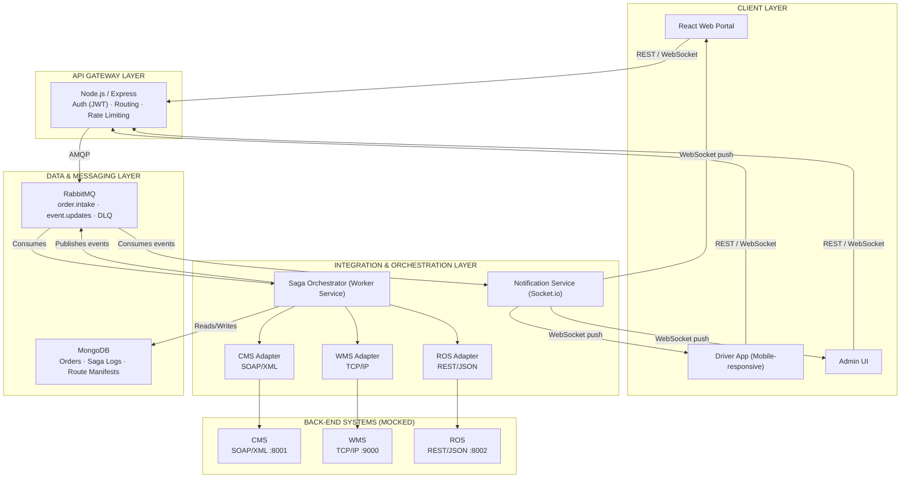
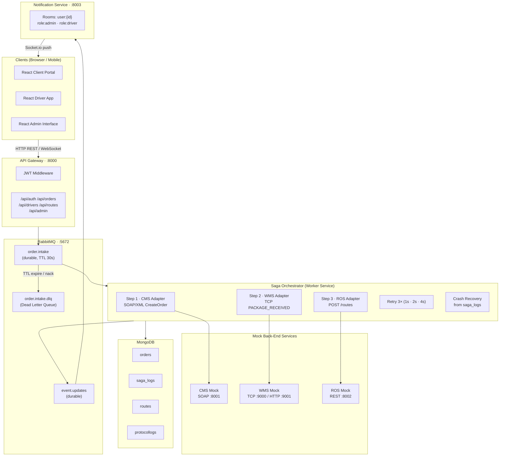
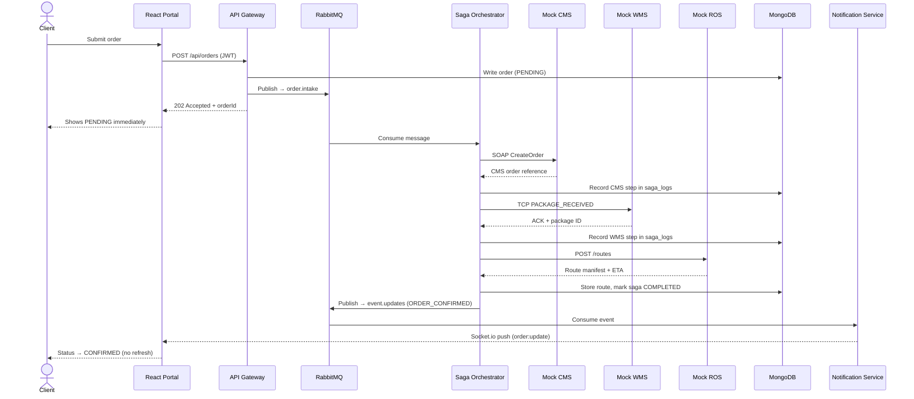
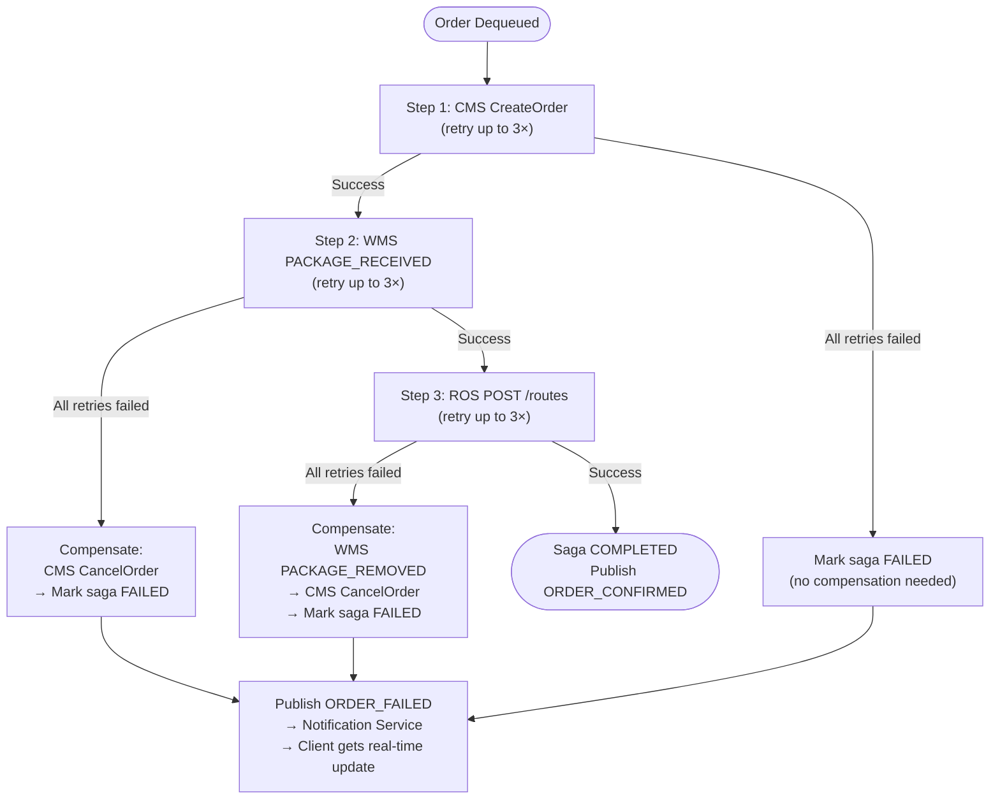
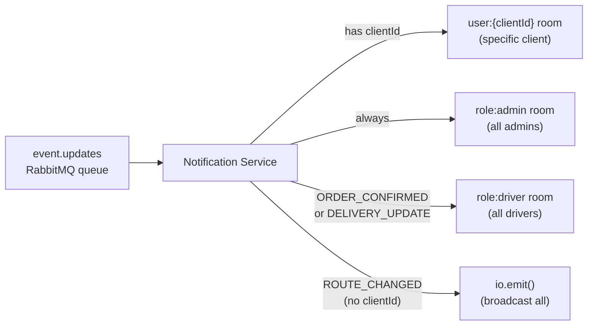

# SwiftLogistics – SwiftTrack Platform
## Middleware Architecture Solution

**University of Colombo School of Computing**  
Department of Computer Science  
SCS2314 — Middleware Architecture | Assignment 4

---

| Index Number | Name |
|---|---|
| [Index Number] | [Name] |
| [Index Number] | [Name] |
| [Index Number] | [Name] |
| [Index Number] | [Name] |
| [Index Number] | [Name] |

**Submission Date:** 28 February 2026

---

## Table of Contents

1. [Introduction](#1-introduction)
2. [Solution Architecture](#2-solution-architecture)
3. [Architectural and Integration Patterns](#3-architectural-and-integration-patterns)
4. [Prototype Implementation](#4-prototype-implementation)
5. [Information Security Considerations](#5-information-security-considerations)
6. [Addressing the Architectural Challenges](#6-addressing-the-architectural-challenges)
7. [Conclusion](#7-conclusion)
8. [References](#references)

---

## 1. Introduction

Swift Logistics (Pvt) Ltd. is a rapidly growing logistics company in Sri Lanka specialising in last-mile delivery for e-commerce businesses. The company serves a diverse client base ranging from large online retailers to independent sellers. To scale operations and remain competitive, Swift Logistics is replacing its existing siloed systems with a modern, integrated platform called SwiftTrack.

SwiftTrack is a web-based portal for e-commerce clients and a mobile-responsive application for delivery drivers. The platform must integrate three core back-end systems that currently operate in isolation: the Client Management System (CMS), the Route Optimisation System (ROS), and the Warehouse Management System (WMS). Each of these systems uses a different communication protocol, presenting a significant integration challenge.

This document describes the middleware architecture designed and implemented to address the integration requirements of SwiftTrack. It covers the proposed architecture, the architectural and integration patterns selected, the technology stack, the prototype implementation, and the information security considerations. The entire solution is built on open-source technologies, satisfying the core constraint of the assignment brief.

---

## 2. Solution Architecture

### 2.1 Conceptual Architecture

The solution adopts a Decentralised Microservices Architecture organised into four functional layers. This separation of concerns allows each layer to evolve independently and supports the scalability and resilience requirements of the platform.

- **Client Layer:** Browser-based and mobile-responsive React frontends for clients, drivers, and an administration interface used for route and order management demonstrations.
- **API Gateway Layer:** A single entry point built with Node.js/Express that handles authentication, request validation, and routing to downstream services.
- **Integration & Orchestration Layer:** A dedicated Node.js Worker Service that acts as a Saga Orchestrator, translating between the heterogeneous protocols of the three back-end systems and managing distributed transactions.
- **Data & Messaging Layer:** RabbitMQ as the message broker for asynchronous communication and MongoDB as the persistence store for orders, saga logs, and route manifests.

#### Conceptual Architecture Diagram



---

### 2.2 Implementation Architecture

The implementation architecture refines the conceptual view into concrete services and communication contracts. Each service runs as an independent Node.js process within its own Docker container, communicating over clearly defined interfaces. The entire platform is started with a single `docker compose up --build` command, which builds all images, installs dependencies, and launches all containers with the correct networking and startup order.

#### Implementation Architecture Diagram



---

### 2.3 Alternative Architectures

#### Alternative 1: Enterprise Service Bus (ESB)

An ESB-based architecture, using a tool such as WSO2 Micro Integrator or Apache Camel, would centralise all integration logic within a single mediation engine. The ESB would handle protocol transformation, routing, and orchestration through configuration-driven pipelines. This approach is well-proven for integrating heterogeneous enterprise systems and provides a rich set of built-in connectors for SOAP, REST, and TCP-based protocols.

The primary drawback of this approach is the single point of failure at the ESB layer. If the ESB becomes unavailable, all integration is blocked. Additionally, ESB solutions tend to be heavyweight, making horizontal scaling more difficult and operational overhead higher. For a system expected to handle unpredictable peak loads such as promotional event surges, this rigidity is a significant concern.

#### Alternative 2: Serverless Event-Driven Architecture (Cloud Functions)

A serverless approach using cloud functions (such as AWS Lambda or Google Cloud Functions) combined with a managed message queue would allow individual integration steps to scale independently and automatically. Each adapter (CMS, WMS, ROS) would be deployed as a separate function, triggered by queue messages. This approach eliminates infrastructure management and scales to zero during idle periods.

The drawback is vendor lock-in with a specific cloud provider and the cold-start latency that serverless functions introduce. The assignment constraint requiring open-source technologies also makes a fully managed cloud-serverless stack incompatible with the brief. Furthermore, stateful saga coordination across serverless functions requires additional tooling that adds complexity.

#### Rationale for the Proposed Architecture

The proposed Decentralised Microservices Architecture was selected because it directly addresses the key non-functional requirements: scalability, resilience, and high-volume asynchronous processing. By decoupling services through RabbitMQ, the system can absorb order bursts during peak events without blocking the client portal. The saga pattern provides explicit distributed transaction management, which is essential given that a single order spans three independent back-end systems. The technology stack is entirely open-source, satisfies the constraint in the brief, and is widely used in production logistics and e-commerce platforms.

---

## 3. Architectural and Integration Patterns

### 3.1 Microservices Pattern

The solution decomposes the platform into independently deployable services: the API Gateway, the Saga Orchestrator (Worker Service), the Notification Service, and the mock back-end adapters. Each service has a well-defined responsibility and communicates through explicit interfaces. This separation allows individual services to be scaled, updated, or replaced without impacting the rest of the system.

This pattern was chosen because the three back-end systems have fundamentally different communication requirements. A monolithic integration layer would tightly couple these concerns, making the system fragile and difficult to extend as Swift Logistics onboards new clients or integrates additional services.

Service discovery is handled by Docker's built-in networking, which provides DNS resolution for service hostnames within the container network. This approach simplifies the prototype by leveraging Docker's service registry capabilities without requiring additional tooling. For production environments with dynamic scaling, a dedicated service registry could be integrated if needed.

### 3.2 API Gateway Pattern

A single Node.js/Express API Gateway serves as the entry point for all client requests. It enforces authentication via JWT, validates incoming requests, and routes them to the appropriate downstream service. Clients are shielded from the internal service topology — they interact with a single, stable endpoint regardless of how the back-end evolves.

Centralising cross-cutting concerns such as authentication, rate limiting (token bucket algorithm), and logging at the gateway reduces duplication across services and provides a single point for enforcing security policy. Rate limiting is particularly important during peak promotional events such as Black Friday and Avurudu sales, where order submission rates can spike significantly.

### 3.3 Publish-Subscribe Pattern (Message Broker)

RabbitMQ is used as the message broker to decouple the API Gateway from the Saga Orchestrator. When a client submits an order, the gateway publishes a message to the `order.intake` queue and immediately returns a `202 Accepted` response to the client. The orchestrator consumes messages from this queue asynchronously, ensuring that the client portal is never blocked while back-end processing takes place.

This pattern directly addresses the brief's requirement for high-volume, asynchronous order processing. During peak events, messages accumulate in the queue and are processed at the rate the orchestrator can handle, preventing cascading failures. RabbitMQ's durable queues ensure that messages survive broker restarts. Multiple Worker Service instances can consume from the same queue simultaneously (Competing Consumers pattern), providing horizontal scalability with no application-level changes.

> **Dead Letter Queue (DLQ):** Each primary queue is paired with a Dead Letter Queue. Messages that fail processing after the maximum number of retry attempts are automatically routed to their DLQ (e.g., `order.intake.dlq`) rather than being discarded. This directly satisfies the requirement that no order is ever lost during processing, even when a back-end system is temporarily unavailable. Operations staff can inspect, correct, and re-queue dead-lettered messages via the RabbitMQ management interface.

### 3.4 Saga Pattern (Orchestration)

A single client order triggers multiple operations: creating the order record in the CMS, registering the package in the WMS, and adding a delivery point to the ROS. These operations span three independent systems, so a distributed transaction mechanism is required.

The solution implements the Saga Orchestration variant, where the Worker Service acts as the central coordinator. It executes each step in sequence, records the result of each step in a saga log in MongoDB, and executes compensating transactions if any step fails after exhausting retries.

- **Retry with exponential backoff:** Before triggering compensation, each failed step is retried up to three times with exponential backoff intervals (1 second, 2 seconds, 4 seconds). This handles transient failures such as temporary network issues or brief back-end unavailability without immediately rolling back a partially completed transaction.
- **Compensating transactions:** If a step fails after all retries, the orchestrator reverses all previously completed steps in order. If WMS registration fails after CMS order creation, the orchestrator cancels the CMS order. If ROS fails after both CMS and WMS succeed, both are cancelled before marking the saga as FAILED.
- **Crash recovery:** On Worker Service restart, the orchestrator queries MongoDB for saga logs in PENDING or PARTIALLY_COMPLETED state and resumes processing from the last successfully recorded step. This ensures no order is permanently lost due to infrastructure failure.

Orchestration was chosen over choreography because it provides a clear, auditable record of each transaction's progress in the saga log, making it straightforward to inspect, debug, and recover failed orders. In a choreography-based saga, the distributed nature of the event chain makes failure diagnosis significantly more complex.

### 3.5 Adapter Pattern (Protocol Translation)

Each of the three back-end systems exposes a different protocol. The Worker Service contains a dedicated adapter for each:

| Adapter | Protocol | Library |
|---|---|---|
| CMS Adapter | SOAP/XML | `soap` (npm) — constructs and parses SOAP envelopes |
| WMS Adapter | TCP/IP (proprietary) | Node.js built-in `net` module |
| ROS Adapter | REST/JSON | `axios` — maps internal order data to ROS request schema |

This pattern isolates protocol-specific logic within each adapter. If a back-end system changes its API, only the corresponding adapter needs to be updated, leaving the rest of the orchestration logic untouched.

### 3.6 Real-Time Notification Pattern (WebSocket Push)

The Notification Service uses Socket.io to maintain persistent WebSocket connections with connected clients, drivers, and admin users. When the Saga Orchestrator completes or fails an order, it publishes a structured event to the `event.updates` RabbitMQ queue. Similarly, when the API Gateway processes a driver delivery confirmation, it publishes a `DELIVERY_UPDATE` event to the same queue. The Notification Service consumes this queue and pushes the event to the relevant Socket.io rooms.

Socket.io room strategy: each connected user joins a room named `user:{userId}` for targeted delivery. Admin users additionally join a `role:admin` room, which receives a copy of every event for operational visibility. This pattern provides the real-time tracking capability required by the brief: when a driver marks a package as delivered, the API Gateway publishes a `DELIVERY_UPDATE` event which propagates through RabbitMQ to the Notification Service and is immediately reflected in the client portal. Push notifications for urgent driver route changes (`ROUTE_CHANGED` events) are broadcast to all connected driver sockets via the same Socket.io path.

---

## 4. Prototype Implementation

### 4.1 Technology Stack

| Component | Technology | Role |
|---|---|---|
| Client Frontend | React (Vite) | Web portal, driver app, admin interface — mobile-responsive |
| API Gateway | Node.js / Express | Authentication, routing, request validation, rate limiting |
| Authentication | JWT (jsonwebtoken) | Stateless token-based auth for all user roles |
| Worker Service | Node.js | Saga Orchestrator — coordinates CMS, WMS, ROS with retry logic |
| Message Broker | RabbitMQ | Durable order queue, event bus, Dead Letter Queues |
| Real-time Push | Socket.io | WebSocket server for live status updates to clients and drivers |
| CMS Adapter | soap (npm) | SOAP/XML communication with mock CMS |
| WMS Adapter | Node.js net module | TCP/IP socket communication with mock WMS |
| ROS Adapter | axios | REST/JSON communication with mock ROS |
| Data Persistence | MongoDB | Orders, saga logs, route manifests, delivery events, protocol transformation logs |
| Mock Back-ends | Node.js (SOAP server, TCP server, Express REST) | Simulated CMS, WMS, and ROS endpoints |
| Containerisation | Docker + Docker Compose | All services run as containers; single command platform startup |

### 4.2 Docker Deployment

All services are containerised using Docker and defined in a single `docker-compose.yml` file at the project root. The platform is fully operational with a single command:

```bash
docker compose up --build
```

Docker Compose handles image building, `npm install` (inside each container's Dockerfile), service networking, startup ordering via `depends_on`, and port mapping. No manual dependency installation or service startup is required on the host machine. The following services are defined:

| Service | Build / Image | Port | Depends On |
|---|---|---|---|
| rabbitmq | rabbitmq:3-management | 5672, 15672 | — (starts first) |
| mongodb | mongo:7 | 27017 | — |
| cms-mock | ./services/cms-mock | 8001 (internal) | mongodb |
| wms-mock | ./services/wms-mock | 9000 TCP (internal), 9001 HTTP (host-mapped) | mongodb |
| ros-mock | ./services/ros-mock | 8002 (internal) | — |
| worker | ./services/worker | — (internal) | rabbitmq, mongodb, cms-mock, wms-mock, ros-mock |
| notification | ./services/notification | 8003 (host-mapped) | rabbitmq |
| api-gateway | ./services/api-gateway | 8000 | rabbitmq, mongodb, worker, notification |
| frontend | ./frontend | 3000 | api-gateway |

Each service's Dockerfile follows the same pattern: base Node.js image, `WORKDIR`, `COPY package.json`, `RUN npm install`, `COPY` source, then `CMD` to start the process. Environment variables (RabbitMQ URL, MongoDB URI, JWT secret, service hostnames) are injected via the `docker-compose.yml` environment section and never hardcoded in source.

### 4.3 Mock Back-End Services

The prototype mocks all three back-end systems to demonstrate the integration architecture without requiring the actual legacy systems. Each mock simulates the protocol and behaviour of the real system. This is intentional and explicitly required by the assignment brief.

- **Mock CMS:** A Node.js SOAP server built with the `soap` library. It exposes a WSDL-defined service accepting order creation and cancellation requests as SOAP/XML envelopes, returning order reference numbers or confirmation codes in XML responses. Persists records to MongoDB. Exposes an HTTP management endpoint supporting an offline toggle, allowing the admin to force the service offline and back online during demos to trigger the saga retry and compensation logic.

- **Mock WMS:** A Node.js TCP server using the `net` module. Listens on port 9000 and processes newline-delimited JSON messages for package registration (`PACKAGE_RECEIVED`), package status updates (`PACKAGE_DELIVERED`), and cancellations (`PACKAGE_REMOVED`), responding with acknowledgement messages over the same socket. Also runs a separate Express HTTP management server on port 9001 for health checks, the offline toggle, and an HTTP delivery notification endpoint called by the API Gateway when a driver confirms delivery.

- **Mock ROS:** An Express REST server exposing a JSON API. `POST /routes` accepts an array of delivery addresses and returns a mock optimised route manifest as JSON including `estimatedMinutes`. `GET /routes/:id` retrieves a stored manifest. `DELETE /routes/:id` is the compensating action. Exposes an offline toggle management endpoint.

### 4.4 Order Submission Flow

The following sequence describes the complete order submission flow through the prototype:



### 4.5 Failure Handling and Compensating Transactions

If any step of the saga fails after exhausting all retries, the orchestrator initiates a compensation sequence:



Additional failure scenarios:

- **Messages that fail all retries before even starting:** Routed automatically by RabbitMQ to `order.intake.dlq` (Dead Letter Queue). No order is ever silently discarded.
- **Worker Service crash mid-saga:** On restart, the orchestrator queries MongoDB for `saga_logs` in `PENDING` or `PARTIALLY_COMPLETED` state and resumes from the last recorded successful step.
- **Real-time failure notification:** After completing compensation, the orchestrator publishes an `ORDER_FAILED` event (containing `orderId` and `clientId`) to `event.updates`. The Notification Service forwards this to the client's Socket.io room, updating the order status to FAILED in the client portal immediately without requiring a page refresh.

All saga state transitions are recorded in the `saga_logs` collection with timestamps and step details, providing a full audit trail for failed order recovery.

### 4.6 Frontend Interfaces and UI Views

Three mobile-responsive React interfaces are implemented, sharing a single responsive design system accessible on both desktop browsers and mobile devices.

#### Client Portal

| View | Description |
|---|---|
| Login | E-commerce client authentication. On login, JWT is stored in `sessionStorage` (not `localStorage`) and a Socket.io connection is opened to receive real-time updates. |
| Order Dashboard | Lists all orders with live status indicators (`PENDING`, `PROCESSING`, `IN_TRANSIT`, `DELIVERED`, `FAILED`). Status updates arrive via Socket.io without page refresh. |
| Order Submission Form | Fields for pickup address, delivery address, package details, and recipient contact. Submits via `POST /api/orders`. UI immediately shows PENDING status and transitions in real time as saga steps complete. |
| Delivery Tracking View | Shows current order status and, when in transit, the estimated arrival time sourced from the ROS route manifest. |

#### Driver Interface

| View | Description |
|---|---|
| Driver Login | Issues a driver-scoped JWT restricting access to the assigned route only. |
| Daily Manifest | Shows the ordered list of deliveries for the day as returned by the ROS. Items reorder automatically on receiving a route update via Socket.io. Displays an online/offline network status indicator. Any deliveries confirmed while offline are queued in `localStorage` and automatically synced (flushed) to the API when connectivity is restored. |
| Delivery Confirmation | Allows the driver to mark a package as DELIVERED or FAILED. For DELIVERED: captures recipient digital signature (canvas touch input) and/or photo (browser MediaDevices camera API). For FAILED: requires a reason code (`RECIPIENT_ABSENT`, `ADDRESS_INCORRECT`, `REFUSED`, `OTHER`) and optional notes. If the device is offline, the confirmation payload is queued in `localStorage` and submitted automatically when the driver regains connectivity. |

#### Admin Interface

The admin dashboard is organised into four tabs:

| Tab | Description |
|---|---|
| Overview | Visibility into all orders with live status indicators updated in real time via Socket.io (admin joins a `role:admin` room and receives every order event). Includes a route change simulator that publishes a `ROUTE_CHANGED` event to RabbitMQ, propagating to all connected driver sockets. |
| Service Health | Current online/offline status of each mock back-end service (CMS, WMS, ROS) polled via their management HTTP endpoints. Toggle buttons allow the admin to force any service offline and back online, demonstrating retry and compensation behaviour under real conditions. |
| Saga Logs | MongoDB `saga_logs` collection in a searchable, paginated view. Each entry shows saga status, step-by-step results for CMS, WMS, and ROS including external reference IDs and ETA, and timestamps. |
| Protocol Logs | Protocol transformation log for all adapter calls (CMS SOAP, WMS TCP, ROS REST). Each entry shows the raw request and raw response at the protocol level alongside the JSON input and output. |

### 4.7 Real-Time Tracking and Notification Architecture

All real-time events flow through a single `event.updates` RabbitMQ queue. The following event types are published:

| Event | Publisher | Payload |
|---|---|---|
| `ORDER_CONFIRMED` | Worker Service (saga complete) | `orderId`, `clientId`, `status: "CONFIRMED"` |
| `ORDER_FAILED` | Worker Service (after compensation) | `orderId`, `clientId` |
| `DELIVERY_UPDATE` | API Gateway (driver delivery confirm) | `orderId`, `clientId`, `status`, `driverId`, optional reason/notes |
| `ROUTE_CHANGED` | API Gateway (admin simulator) | — (broadcast to all) |

#### Notification Routing



The React frontend's `useSocket` hook subscribes to `order:update` Socket.io events and applies status updates directly to local state, updating the UI without a page refresh. The Driver Manifest listens for `ROUTE_CHANGED` and refetches the manifest from the API. The prototype fully implements the real-time tracking path end-to-end for all event types.

---

## 5. Information Security Considerations

### 5.1 Authentication and Authorisation

All API endpoints exposed by the API Gateway are protected with JWT-based authentication. On login, the server issues a signed JWT containing the user's ID and role (`client`, `driver`, or `admin`). Every subsequent request must include this token in the `Authorization` header. The gateway validates the signature and expiry before forwarding the request. Role-Based Access Control (RBAC) ensures that clients can only access their own orders, drivers can only access their assigned route, and admin endpoints are role-restricted.

JWTs are stored in `sessionStorage` on the client side (not `localStorage`) to reduce XSS exposure. `sessionStorage` is cleared automatically when the browser tab is closed, limiting token lifetime to the active session. Tokens are issued with an 8-hour expiry in the prototype; a shorter expiry with a refresh token mechanism would be appropriate for production deployment.

### 5.2 Transport Security

In a production deployment, all communication between clients and the API Gateway is encrypted using TLS 1.3 (HTTPS and WSS). Communication between internal Docker services uses the isolated Docker bridge network, which is not exposed externally. Communication with the external ROS REST API uses TLS with certificate validation enforced. In the prototype, services communicate over the Docker internal network for simplicity.

### 5.3 Input Validation

All incoming request payloads at the API Gateway are validated for required fields, correct data types, and safe string formats before they are processed or published to the queue. This prevents malformed data from propagating through the pipeline and reduces the attack surface for injection attacks.

### 5.4 Message Broker Security

RabbitMQ is configured to require authentication for all connections. Each internal service connects using a dedicated service account with permissions limited to the queues it needs to read or write. The RabbitMQ management interface (port 15672) is not exposed outside the Docker internal network.

### 5.5 Data Security

Client credentials and driver personal information are stored in MongoDB with passwords hashed using bcrypt. The MongoDB instance is accessible only within the Docker internal network. Database access credentials are injected via Docker environment variables and never committed to source control. Proof-of-delivery photos and signatures are stored as Base64-encoded strings within the Order document in MongoDB, transmitted over the authenticated API endpoint (`express.json` body limit raised to 10 MB to accommodate image payloads). In a production deployment, large binary assets would be migrated to object storage (e.g., MongoDB GridFS or S3-compatible storage) with the Order document holding only a reference URL.

### 5.6 SOAP and TCP Communication Security

The SOAP channel to the CMS and the TCP channel to the WMS are internal to the Docker network and not externally exposed. In production, WS-Security headers would be added to SOAP requests for the CMS, and the TCP channel to the WMS would be wrapped in TLS. API keys for external services are stored as Docker environment variables.

### 5.7 Audit Logging

All authentication events and order state transitions are recorded as immutable events in MongoDB with timestamps, user IDs, and outcomes. The `saga_logs` collection provides a full audit trail of every distributed transaction, including retry attempts, compensations, and DLQ routing. This supports forensic analysis of integration failures and dispute resolution.

---

## 6. Addressing the Architectural Challenges

The brief outlines six specific architectural challenges that the middleware solution must address. This section discusses how each challenge is tackled by the proposed architecture and implementation.

### 6.1 Heterogeneous Systems Integration

The three back-end systems (CMS, ROS, WMS) use incompatible protocols: SOAP/XML, REST/JSON, and proprietary TCP/IP messaging. The Adapter Pattern isolates protocol-specific logic within dedicated adapters in the Worker Service, each using appropriate libraries (`soap` for SOAP, `axios` for REST, Node.js `net` for TCP). This ensures clean separation of concerns and easy maintenance if protocols change. The Saga Orchestrator coordinates these adapters sequentially, transforming internal JSON data structures to the required protocol formats and parsing responses back to JSON for logging and persistence.

### 6.2 Real-Time Tracking and Notifications

Real-time updates are critical for clients tracking deliveries and drivers receiving route changes. The solution uses Socket.io for WebSocket push notifications, with events published to RabbitMQ's `event.updates` queue by the Saga Orchestrator and API Gateway. The Notification Service consumes this queue and routes events to Socket.io rooms (`user:{id}` for targeted updates, `role:admin` for visibility). This provides sub-second propagation of status changes (e.g., order confirmed, delivered, failed) without client polling, supporting the brief's requirement for immediate reflection in the client portal when a driver marks a package as delivered.

### 6.3 High-Volume, Asynchronous Processing

Order processing must not block the client portal during peak events like Black Friday. The Publish-Subscribe Pattern with RabbitMQ decouples order submission from processing: the API Gateway publishes to `order.intake` and returns `202 Accepted` immediately. The Saga Orchestrator consumes asynchronously, allowing the queue to buffer bursts. Durable queues survive restarts, and the Competing Consumers pattern enables horizontal scaling of Worker instances. Dead Letter Queues ensure no order is lost if processing fails repeatedly.

### 6.4 Transaction Management

A single order spans three systems, requiring distributed transaction consistency. The Saga Orchestration Pattern manages this with sequential steps, retry (up to 3 times with exponential backoff), and compensating transactions (e.g., cancel CMS order if WMS fails). Saga logs in MongoDB record each step's outcome, enabling crash recovery and audit trails. This ensures orders are never partially processed without rollback, addressing the brief's requirement that an order is never lost even if a back-end is unavailable.

### 6.5 Scalability and Resilience

The microservices architecture allows independent scaling: multiple Worker instances can consume from the same queue, API Gateway can be load-balanced, and Notification Service can scale with WebSocket connections. Docker containerisation isolates failures (e.g., one service crash doesn't affect others), and RabbitMQ's message broker absorbs load spikes. Resilience is enhanced by retry logic, DLQs, and saga recovery from logs, ensuring the system handles increasing clients, drivers, and deliveries without single points of failure.

### 6.6 Security

All communication is secured via JWT authentication with RBAC, input validation at the API Gateway, and bcrypt-hashed passwords in MongoDB. Transport security uses TLS in production (HTTPS/WSS), with Docker network isolation internally. RabbitMQ requires authentication with limited permissions, and audit logs track all events. This protects against unauthorized access, data breaches, and injection attacks, as required by the brief.

---

## 7. Conclusion

The proposed Decentralised Microservices Architecture provides a robust foundation for the SwiftTrack platform. By leveraging open-source technologies such as Node.js, RabbitMQ, MongoDB, and Socket.io, the solution meets all functional and non-functional requirements outlined in the brief. The prototype demonstrates end-to-end integration, real-time notifications, and fault tolerance, serving as a solid proof-of-concept for production deployment. Future enhancements could include production hardening (e.g., TLS everywhere, monitoring with Prometheus/Grafana) and additional features like advanced analytics or multi-tenant support.

---

## References

- Hohpe, G. & Woolf, B. (2003). *Enterprise Integration Patterns: Designing, Building, and Deploying Messaging Solutions*. Addison-Wesley.
- Richardson, C. (2018). *Microservices Patterns*. Manning Publications.
- Garcia-Molina, H. & Salem, K. (1987). Sagas. *ACM SIGMOD Record*, 16(3), 249–259.
- RabbitMQ. (2024). RabbitMQ Documentation. https://www.rabbitmq.com/docs
- MongoDB Inc. (2024). MongoDB Documentation. https://www.mongodb.com/docs/
- Socket.io. (2024). Socket.io Documentation. https://socket.io/docs/
- Node.js Foundation. (2024). Node.js Documentation. https://nodejs.org/en/docs/
